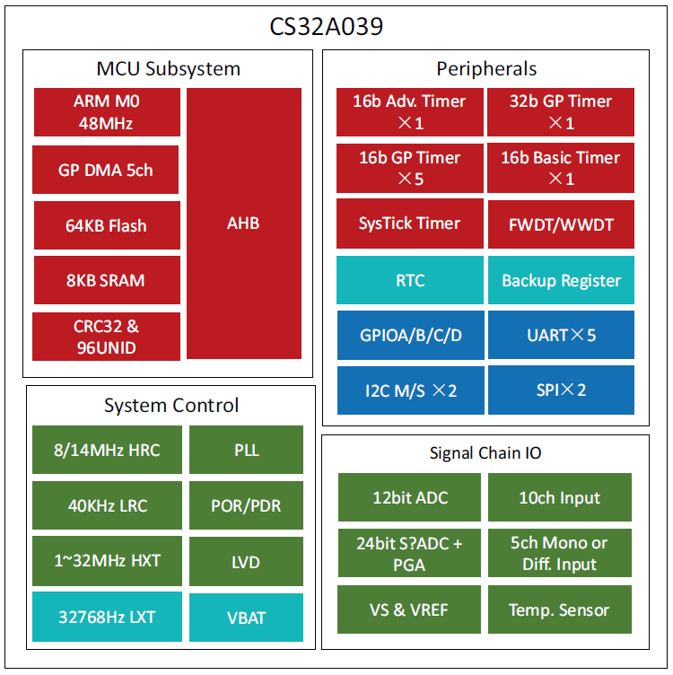

# [CS32A039](https://github.com/SoCXin/CS32A039)

* [chipsea](http://www.chipsea.com): [Cortex-M0+](https://github.com/SoCXin/Cortex)
* [L3R4](https://github.com/SoCXin/Level): 48 MHz

## [Xin简介](https://github.com/SoCXin/CS32A039/wiki)

[CS32A039](https://github.com/SoCXin/CS32A039)是芯海科技推出的32位工业级信号链MCU，采用ARM® Cortex®-M0 内核，频率48MHz，最高集成64Kbytes flash和8Kbytes SRAM，并提供丰富的通信接口（I2C、SPI/I2S和USART）和多达12个定时器，具备可靠性高、精度高、功耗低等特点。

集成丰富的信号链IO，包括INL低至1.2LSB的12位ADC、±2℃精度的温度传感器等、24位ΣΔADC、全差分零漂移放大器，适用于高精度测温、红外传感器等需要高精度测量的应用。

#### 关键特性

* 1路24位ΣΔADC，ENOB最高22.3位
* 12bit 1μS ADC，INL低至1.2LSB
* 全差分零漂移放大器，增益1/2/4/8/16/32/64/128倍可调
* 32~64KBytes的Flash存储器，支持硬件校验
* 192Bytes数据Flash存储器
* 4~8KBytes的SRAM，带硬件奇偶校验

### [xin资源](https://github.com/SoCXin/CS32A039)

* [参考资源](src/)
* [相关文档](docs/)
* [典型应用](project/)
* [入门教程](https://docs.soc.xin/CS32A039)

### [选型建议](https://github.com/SoCXin)

[CS32A039](https://github.com/SoCXin/CS32A039)

### [探索芯世界 www.SoC.xin](http://www.SoC.Xin)
