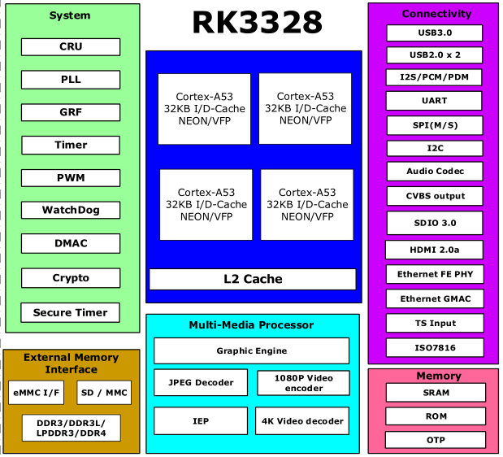

# [RK3328](https://github.com/mcuyun/RK3328) 

#### 归属：[cortex A53系列](https://github.com/mcuyun/CA53)
#### [关于悠云](https://github.com/mcuyun/whyme)可访问 www.mcuyun.com

## [简介](https://github.com/mcuyun/RK3328/wiki)

瑞芯微中端盒子处理器，4xA53 with 1.5GHz，主要特点：USB 3.0

### [瑞芯微平台](https://github.com/mcuyun/rockchips)

平台相关资料

#### [linux系统](https://github.com/rockchip-linux/kernel.git)

开源Linux系统固件

#### [参考资料](docs/)

包括芯片相关资料
 

---

###  [悠云，为嵌入式](http://www.mcuyun.com)   
###  qitas@qitas.cn

